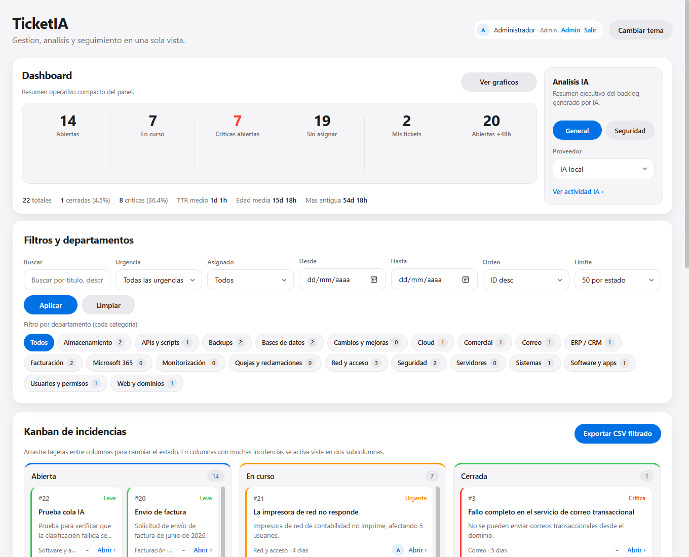
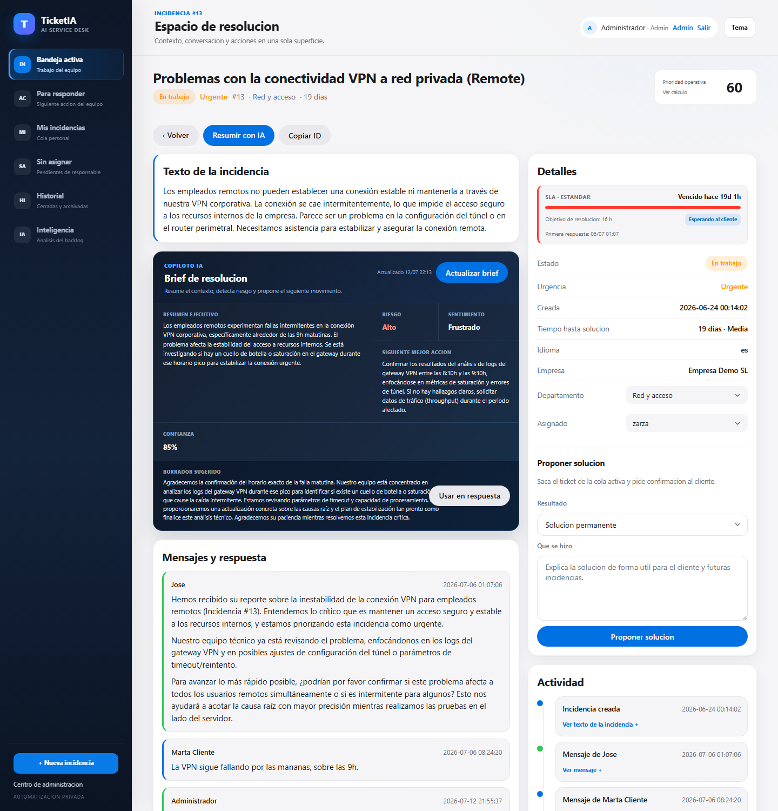
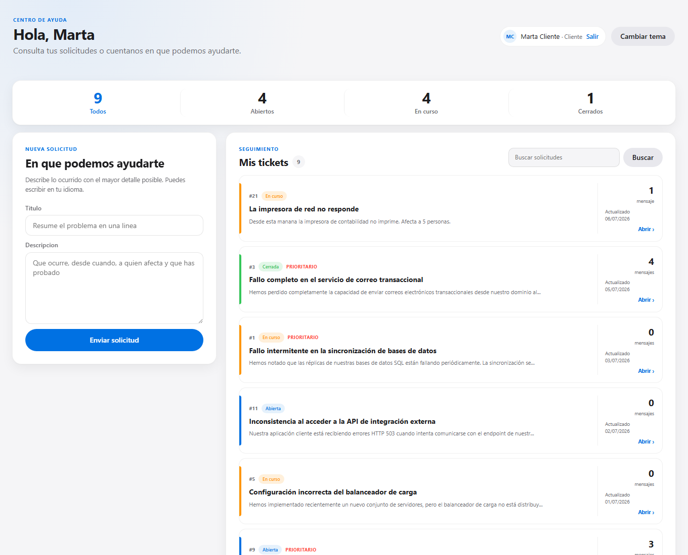
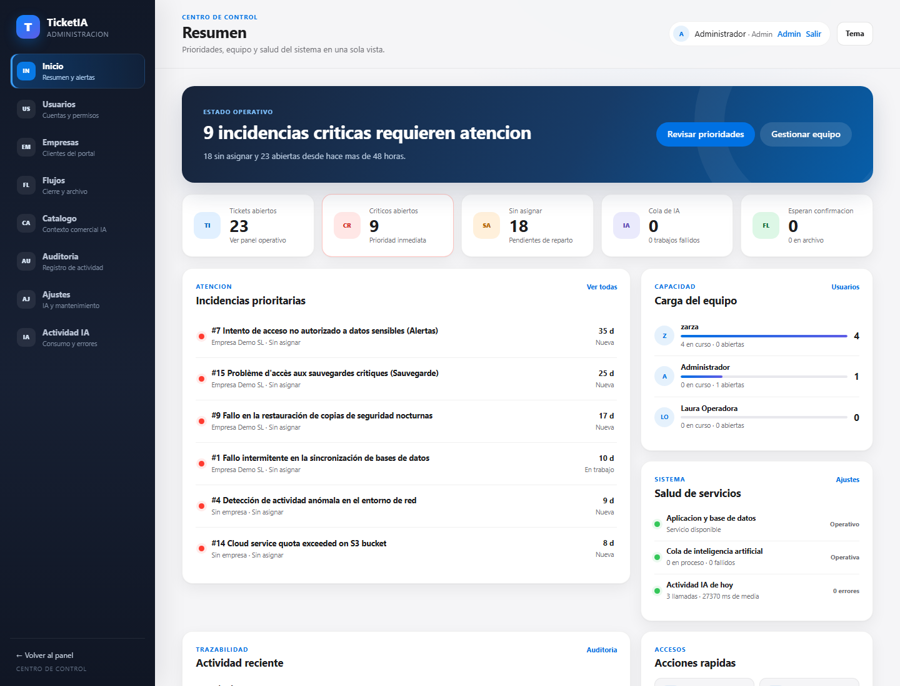

# TicketIA

**Helpdesk open source con IA — self-hosted, multilingüe y con soporte de IA 100% local.**

*Open source AI-powered helpdesk — self-hosted, multilingual, works with fully local AI.*

> ⚠️ **Estado: en desarrollo activo (pre-v1.0).** Incluye autenticación con roles, CSRF y
> auditoría, pero aún no ha pasado una revisión de seguridad externa.

---

## ¿Qué es?

TicketIA es un sistema de gestión de incidencias que usa modelos de lenguaje (LLM) para
automatizar el trabajo repetitivo del soporte:

- 🤖 **Triage automático**: cada ticket nace clasificado (urgencia, departamento, idioma,
  resumen y recomendación de actuación) sin bloquear al usuario — la IA trabaja en segundo plano.
- 🌍 **Multilingüe real**: el cliente escribe en su idioma; el equipo trabaja en español.
  Traducción bidireccional con caché (cada contenido se traduce una sola vez).
- 📊 **Análisis ejecutivo del backlog**: informes generados por IA en streaming, con vista
  especializada en incidencias de seguridad.
- 🔍 **Detección de duplicados** al crear un ticket (búsqueda FULLTEXT).
- ✍️ **Borradores de respuesta** sugeridos por IA en la conversación.
- **Copiloto operativo por ticket**: sintetiza el hilo, propone la siguiente accion,
  permite traducir el contenido e integra recomendaciones de catalogo en incidencias comerciales.
- **SLA y colas inteligentes**: objetivos configurables por nivel de cliente, tipo de
  incidencia y urgencia, avisos de riesgo y bandejas para
  respuesta pendiente, espera del cliente y tickets sin asignar.
- **Bandeja operativa renovada**: navegación lateral sin accesos duplicados, alta rápida
  de incidencias, prioridades accionables y listado ordenable; el Kanban queda como vista opcional.
- **Ciclo de vida y archivo**: el equipo propone una solución, el cliente la confirma o
  rechaza y el sistema cierra y archiva automáticamente según reglas configurables. El
  histórico queda paginado fuera de la bandeja diaria, sin borrar trazabilidad.
- **Operaciones en lote**: seleccion multiple en Kanban y lista para cambiar estado o
  responsable sin abrir cada incidencia.
- 💼 **Recomendación comercial**: cruza tickets comerciales con tu catálogo de productos.
- 📈 **Observabilidad de IA**: latencia, tokens y errores por proveedor.
- 🔒 **Privacidad**: funciona con IA local (LM Studio, Ollama o cualquier API compatible
  OpenAI). Los proveedores cloud (OpenAI, xAI) son opcionales. Los modelos razonadores
  (DeepSeek-R1, Qwen3, gpt-oss…) están soportados: el razonamiento se filtra automáticamente.
- 🏢 **Multicliente con portal**: cada empresa ve solo sus tickets; los clientes crean y
  siguen los suyos desde un portal propio, sin acceso a los datos internos del equipo.
- 📎 **Adjuntos seguros**: validación por contenido real, almacenados fuera del docroot y
  descarga siempre autenticada.
- 🗒️ **Notas internas** en la conversación, visibles solo para el equipo (nunca se traducen
  ni llegan al cliente).
- ✉️ **Notificaciones por email** (opcionales, SMTP): ticket nuevo, respuestas y cambios de
  estado, con enlaces al portal o al panel según el destinatario.
- ⚙️ **Cola de trabajos IA**: si el proveedor está caído, la clasificación se encola y un
  worker la reintenta con backoff; incluye límite diario de llamadas de pago y modo
  solo-local para coste cero garantizado.
- 🛡️ **Panel de administración**: usuarios y roles, empresas, auditoría, SLA, reglas de
  cierre/archivo, catálogo comercial para la IA y ajustes con prueba de conexión en vivo.

Interfaz con lista operativa y Kanban opcional, filtros persistentes, cola personal del
operador, asignación de técnicos, historial separado y modo oscuro.

## Capturas

| Panel del equipo | Detalle de incidencia |
|---|---|
|  |  |

| Portal de cliente | Administración |
|---|---|
|  |  |

## Requisitos

- PHP >= 8.2 con `pdo_mysql`, `curl`, `mbstring`
- MySQL 8 / MariaDB 10.6+
- Composer
- Opcional: un servidor de IA local (LM Studio u Ollama) o claves de OpenAI/xAI

## Instalación con Docker (recomendada)

```bash
git clone https://github.com/zarzawan/ticketia.git
cd ticketia
cp .env.example .env          # cambia DB_PASS y DB_ROOT_PASS
docker compose up -d --build db php nginx
docker compose exec php php bin/instalar.php --con-demo
docker compose up -d worker
```

Abre **http://localhost:8080** — el instalador habrá creado el usuario administrador
(`admin@ticketia.local` con contraseña generada, mostrada por consola; o pasa
`--admin-email=... --admin-pass=...` para elegirla) y tendrás el panel con datos de
demostración. Desde **Usuarios** puedes crear el resto de cuentas (admin, operador,
comercial, cliente).

Las imágenes ya contienen Composer, dependencias PHP y los archivos públicos. El código
no se monta desde el equipo anfitrión: solo persisten la base de datos y los adjuntos en
volúmenes. Para actualizar, ejecuta `git pull` y vuelve a lanzar
`docker compose up -d --build`.

Mailpit está disponible como perfil opcional de desarrollo con
`docker compose --profile dev up -d mailpit` y abre su interfaz en
**http://localhost:8025**.

> Antes de exponer TicketIA fuera de tu equipo, sustituye todas las contraseñas de
> `.env`, configura `APP_URL` con la URL pública y prepara copias de seguridad de los
> volúmenes `datos_db` y `adjuntos`.

> Para usar tu IA local desde Docker, en `.env` usa
> `LLM_LOCAL_ENDPOINT=http://host.docker.internal:1234/v1/chat/completions`.

## Instalación manual (XAMPP, hosting compartido, VPS…)

```bash
git clone https://github.com/zarzawan/ticketia.git
cd ticketia
composer install
cp .env.example .env          # configura la BD, APP_URL y la IA
php bin/instalar.php --con-demo
```

Apunta el *document root* de tu servidor web al directorio **`public/`** y abre `index.php`.

## Configurar la IA

Todo se configura en `.env` (ver `.env.example`):

| Variable | Descripción |
|---|---|
| `LLM_PROVIDER` | Proveedor activo: `local`, `openai` o `xai` (también cambiable desde el panel) |
| `LLM_LOCAL_ENDPOINT` | URL de tu servidor local compatible OpenAI (LM Studio: puerto 1234, Ollama: 11434) |
| `LLM_LOCAL_MODEL` | Identificador del modelo cargado |
| `OPENAI_API_KEY` / `XAI_API_KEY` | Solo si quieres proveedores cloud (de pago, clave propia) |

Sin IA configurada, TicketIA funciona como un helpdesk convencional: los tickets se crean
con valores por defecto y puedes clasificarlos a mano o re-clasificarlos con IA más tarde.

Control de coste: `LLM_SOLO_LOCAL=1` ignora los proveedores de pago aunque haya claves, y
`LLM_MAX_LLAMADAS_DIA` corta las llamadas de pago al alcanzar el cupo diario.
`LLM_LOG_RETENTION_DIAS` define cuantos dias se conservan las trazas; el worker
elimina los registros antiguos por lotes.

## Operacion profesional

Consulta la [guia de actualizacion y puesta en servicio](docs/OPERACION_PROFESIONAL.md)
para activar borradores privados, fuentes del copiloto, equipos, calendario laboral
y el panel de entregas y conservacion. Las migraciones no se aplican solas.

## Worker de trabajos IA y correo

Las tareas de IA que fallan (proveedor caído, timeout) se encolan y se reintentan con
backoff. El mismo worker aplica el cierre y archivo automáticos. Programa el proceso con
cron o el Programador de tareas de Windows:

```bash
php bin/worker.php            # procesa hasta 10 trabajos y termina
php bin/worker.php --bucle    # en bucle continuo (servicio)
```

En Docker, el servicio `worker` ejecuta el bucle de forma permanente y se recupera de
reinicios. Se inicia después del instalador con `docker compose up -d worker`.

Administración, Configuración y Control IA muestran su última señal real. El CLI
registra actividad al arrancar, entre trabajos (como máximo cada 15 segundos) y
al terminar una ejecución puntual. La cola vacía y el botón de procesado manual
no se interpretan como prueba de automatización activa.

`WORKER_ALERTA_SEGUNDOS` (600 por defecto, de 60 a 86400) controla el aviso de falta
de actividad. Debe superar el intervalo programado y la duración máxima de una
tarea. «Actividad reciente» no garantiza que el proceso siga vivo ni que sus
trabajos hayan tenido éxito; comprueba también los fallidos y los registros.
El aviso aparece al cargar el panel: no envía notificaciones externas ni arranca
el servicio. El registro reutiliza una única clave de `ajustes`, sin migración.

## Notificaciones por email (opcional)

Configura `SMTP_HOST`, `SMTP_USER`, `SMTP_PASS` y `APP_URL` en `.env` (ver
`.env.example`). Sin SMTP configurado no se envía nada y todo funciona igual.

## Seguridad de acceso

Cada usuario puede activar TOTP desde **Mi cuenta** y recibe ocho códigos de recuperación
de un solo uso. Antes de habilitarlo, genera una clave única y guárdala como `APP_KEY` en
`.env`:

```bash
php -r "echo bin2hex(random_bytes(32)), PHP_EOL;"
```

No cambies esa clave después de activar 2FA: protege los secretos cifrados almacenados en
la base de datos. La recuperación de contraseña utiliza SMTP, enlaces de 30 minutos,
tokens almacenados como hash y revocación de las sesiones anteriores.

## Administración y centro de ayuda

La administración agrupa personas, organizaciones, servicio e IA. El portal
separa solicitudes en seguimiento, respuestas, soluciones por confirmar e historial.
Los directorios cargan 25 filas por página y el portal usa paginación por cursor.

En **Administración → Conocimiento** se crean guías internas o para clientes.
La IA puede preparar un borrador a partir de una incidencia resuelta; una persona
debe revisar el contenido y confirmar su publicación. Solo los artículos publicados
para clientes aparecen en su portal y en las sugerencias al crear una solicitud.
El solicitante puede valorar la atención una vez resuelta su incidencia.

Consulta [las decisiones del rediseño](docs/REDISENO_2026.md) para el alcance,
las referencias de producto y las siguientes prioridades.

## Tests

```bash
vendor/bin/phpunit
```

Para comprobar flujos completos con MariaDB local y una IA simulada:

```bash
php tests/integration/experiencia.php
```

Usa una cuenta con permiso de crear bases mediante `TEST_DB_USER` y
`TEST_DB_PASS` (por defecto root local sin contraseña). El ensayo crea y elimina
su propia base `ticketia_pruebas_*` y usa los puertos 8091 y 8092; no siembra ni
modifica la base de desarrollo. Con `--visual` en una terminal interactiva,
mantiene el entorno hasta pulsar Enter para revisar las pantallas.

La CI de GitHub Actions ejecuta lint, tests (PHP 8.2–8.3), escaneo de secretos y una
prueba de humo Docker completa: levanta la pila, comprueba extensiones, instala el
esquema, inicia el worker y valida un inicio de sesión real.

## Hoja de ruta hacia v1.0

- [x] Núcleo de tickets + IA (POC endurecida)
- [x] Instalador, migraciones, Docker, datos de demo
- [x] Autenticación, roles, CSRF, auditoría, 2FA y recuperación por email
- [x] Multicliente y adjuntos
- [x] Portal de cliente con notificaciones email
- [x] Panel de administración
- [x] Cola de trabajos IA y control de coste
- [x] Tests + CI
- [x] Release v1.0 y repositorio público

Post-v1: email-to-ticket, búsqueda semántica con embeddings, SLA con alertas y API REST.

## Contribuir

Issues y pull requests son bienvenidos. Lee [CONTRIBUTING.md](CONTRIBUTING.md), el
[código de conducta](CODE_OF_CONDUCT.md) y la [política de seguridad](SECURITY.md).

## Licencia

[AGPL-3.0](LICENSE) — TicketIA es libre y lo seguirá siendo: cualquier servicio basado en
este código debe publicar sus modificaciones.
